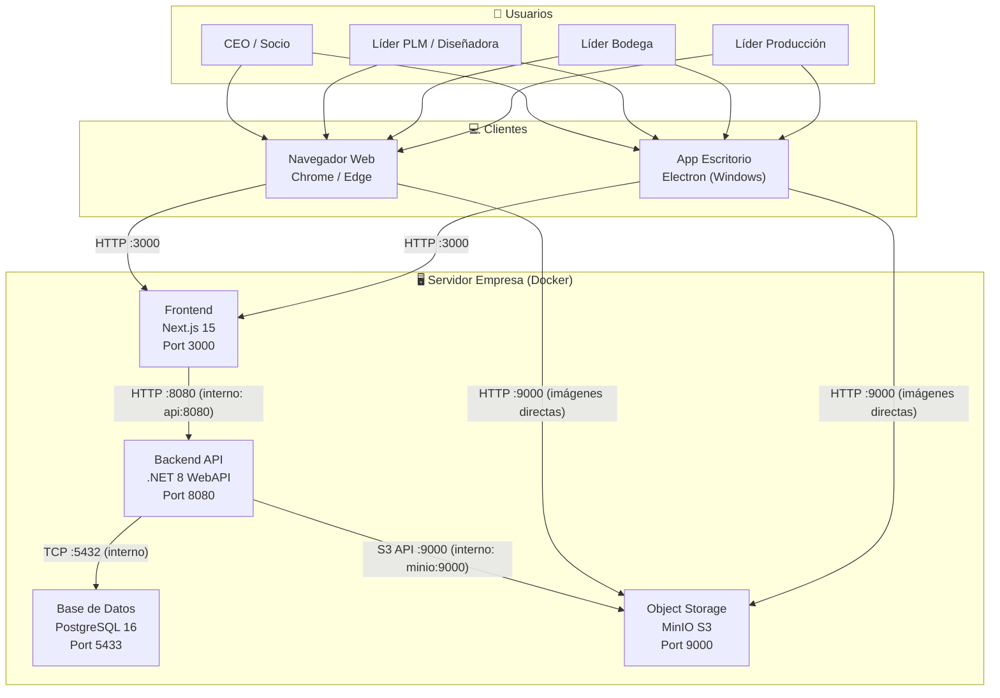
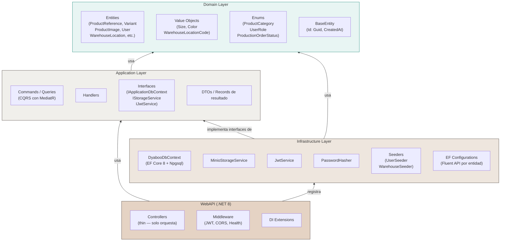
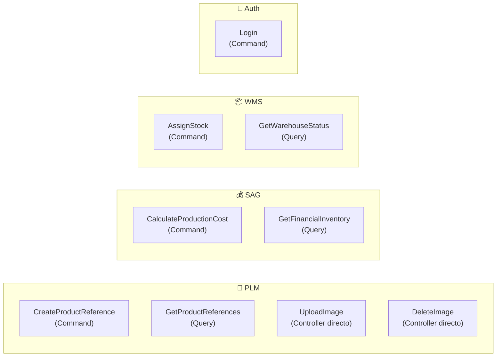

# Arquitectura del Sistema

## Visión general — C4 Nivel 2 (Contenedores)



## Clean Architecture — Capas del Backend



## Regla de dependencias

```
WebAPI → Application → Domain
Infrastructure → Application (implementa interfaces)
Infrastructure → Domain (usa entidades)
```

**Nunca:** Domain → Application, Domain → Infrastructure, Application → Infrastructure, Application → WebAPI.

## Módulos de negocio y sus features



## Stack tecnológico completo

| Capa | Tecnología | Versión |
|---|---|---|
| Runtime backend | .NET / ASP.NET Core | 8.0 |
| ORM | Entity Framework Core + Npgsql | 8.x |
| Mediator | MediatR | 12.x |
| Base de datos | PostgreSQL | 16 |
| Object storage | MinIO | RELEASE.2025 |
| SDK MinIO .NET | Minio | 6.0.4 |
| Runtime frontend | Node.js | 20 LTS |
| Framework UI | Next.js (App Router) | 15.3 |
| Lenguaje frontend | TypeScript | 5.x |
| Estilos | Tailwind CSS | 3.x |
| App escritorio | Electron | 31.x |
| Empaquetador | electron-builder | 24.x |
| Contenedores | Docker + Compose | v2 |
| Auth | JWT Bearer (HS256) | — |
