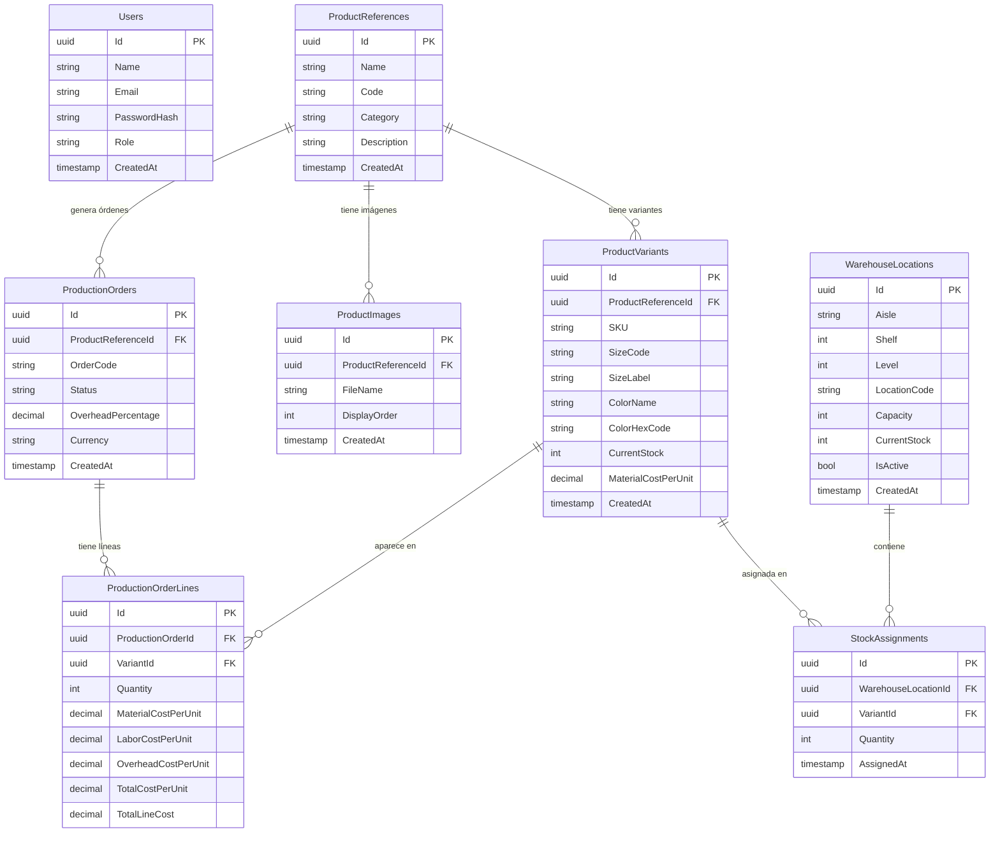

# Base de Datos

## Diagrama entidad-relación



## Notas sobre el esquema

### Value Objects en EF Core
Los Value Objects de Domain no son tablas separadas — se almacenan como columnas dentro de la entidad dueña usando `OwnsOne`:

```csharp
// En ProductVariantConfiguration:
builder.OwnsOne(v => v.Size, s => {
    s.Property(x => x.Code).HasColumnName("SizeCode");
    s.Property(x => x.Label).HasColumnName("SizeLabel");
});
builder.OwnsOne(v => v.Color, c => {
    c.Property(x => x.Name).HasColumnName("ColorName");
    c.Property(x => x.HexCode).HasColumnName("ColorHexCode");
});

// En WarehouseLocationConfiguration:
builder.OwnsOne(l => l.LocationCode, lc => {
    lc.Property(x => x.Aisle).HasColumnName("Aisle");
    lc.Property(x => x.Shelf).HasColumnName("Shelf");
    lc.Property(x => x.Level).HasColumnName("Level");
    lc.Property(x => x.Code).HasColumnName("LocationCode");
});
```

### Enums almacenados como strings
Todos los enums se guardan como texto en PostgreSQL para facilitar lectura directa de BD:
```csharp
builder.Property(u => u.Role).HasConversion<string>();
builder.Property(p => p.Category).HasConversion<string>();
builder.Property(o => o.Status).HasConversion<string>();
```

### Cascade delete
`ProductImages` y `ProductVariants` tienen `DeleteBehavior.Cascade` respecto a `ProductReference`. Si se elimina una referencia, sus variantes e imágenes se eliminan automáticamente (incluyendo las imágenes físicas en MinIO, gestionadas en el controller).

## Migraciones EF Core

```bash
# Crear nueva migración
dotnet ef migrations add <NombreMigración> \
  --project src/Dyaboo.Infrastructure \
  --startup-project src/Dyaboo.WebAPI

# Aplicar migraciones a la BD
dotnet ef database update \
  --project src/Dyaboo.Infrastructure \
  --startup-project src/Dyaboo.WebAPI

# Ver SQL que se ejecutaría (sin aplicar)
dotnet ef migrations script \
  --project src/Dyaboo.Infrastructure \
  --startup-project src/Dyaboo.WebAPI
```

En Docker, las migraciones se aplican automáticamente al arrancar la API (`db.Database.MigrateAsync()` en `Program.cs`).

## Seeders que corren en startup

| Seeder | Descripción |
|---|---|
| `UserSeeder` | Crea usuarios demo con roles predefinidos si la tabla está vacía |
| `WarehouseSeeder` | Crea 600 ubicaciones de bodega (Pasillos A-F × 10 estantes × 10 niveles) si la tabla está vacía |
| `MinioInitializer` | Crea el bucket `dyaboo-assets` con política de lectura pública si no existe |
