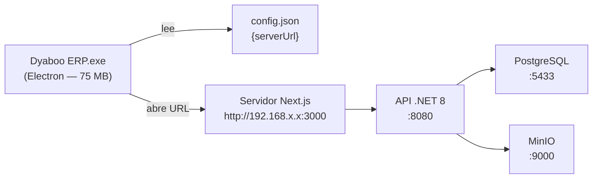
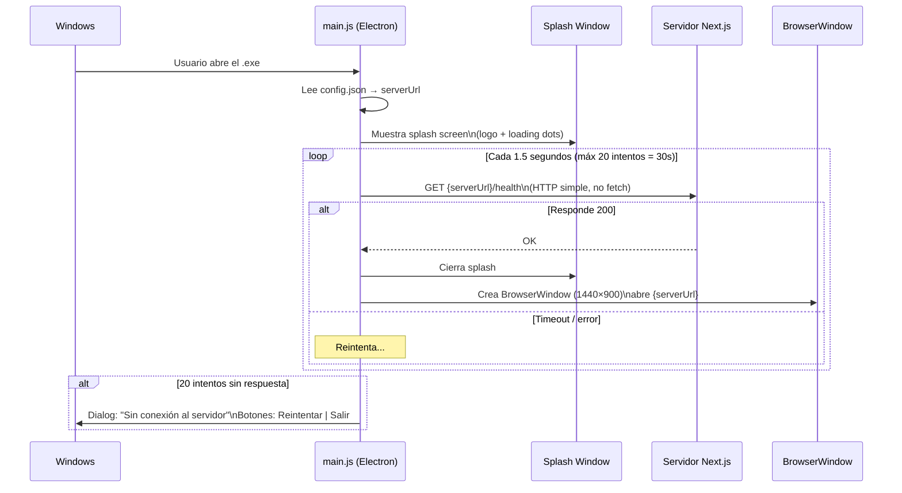
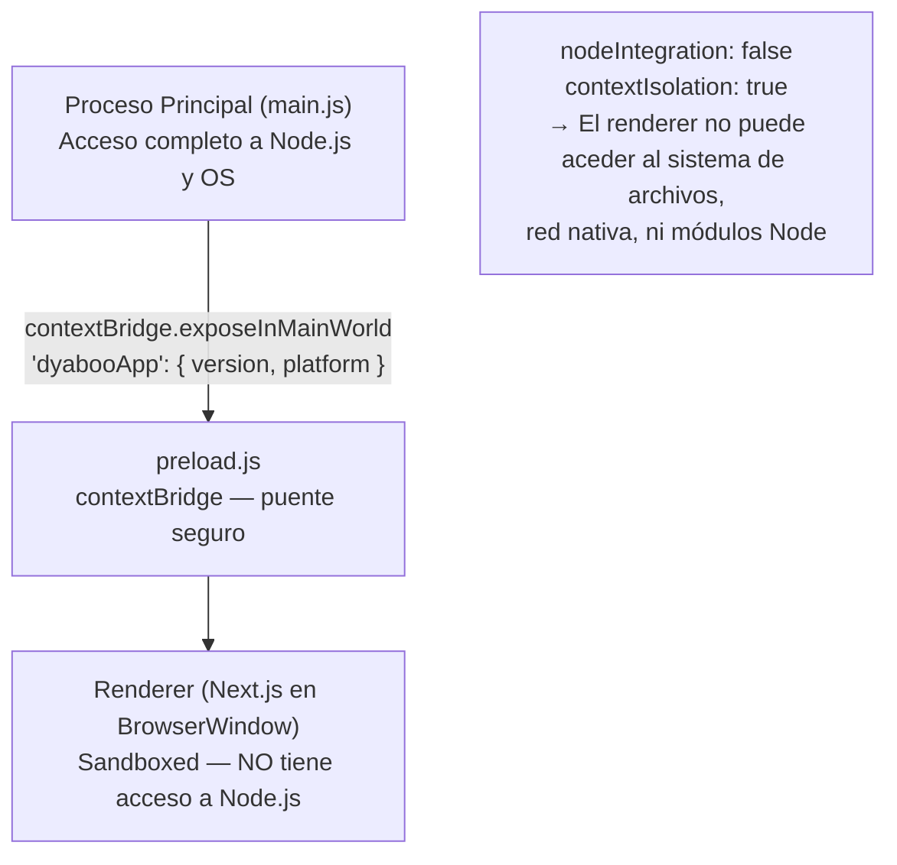

# App de Escritorio — Electron (Windows)

## Concepto

Electron es un **thin client** — no empaqueta el backend ni la base de datos. Abre una ventana de navegador apuntando al servidor Next.js de la empresa. Los empleados reciben un `.exe` que se comporta como app nativa pero consume el servidor central.



**Prerequisito**: El empleado debe estar conectado a la red local de la empresa (LAN o VPN). Sin red, la app muestra el diálogo "Sin conexión".

## Flujo de arranque



## Estructura de archivos

```
electron/
├── src/
│   ├── main.js          ← Proceso principal: ventana, splash, polling
│   └── preload.js       ← contextBridge (seguridad: no expone Node.js al renderer)
├── splash/
│   └── index.html       ← Pantalla de carga (HTML puro, sin dependencias)
├── icons/
│   └── icon.ico         ← Multi-size ICO (16,32,48,64,128,256 px)
├── config.json          ← { "serverUrl": "http://localhost:3000" }
├── package.json         ← electron-builder config + scripts
└── .gitignore           ← dist/, node_modules/
```

## Configuración antes de distribuir

Editar `electron/config.json` con la IP real del servidor:

```json
{
  "serverUrl": "http://192.168.1.100:3000"
}
```

Luego reconstruir:
```bash
cd electron
npm run build        # NSIS installer + portable (requiere Wine en Linux)
npm run build:dir    # Solo directorio desempaquetado (sin Wine)
```

## Targets de distribución

| Target | Archivo | Tamaño | Uso |
|---|---|---|---|
| NSIS installer | `Dyaboo ERP Setup 1.0.0.exe` | ~75 MB | Instalación con acceso directo |
| Portable | `Dyaboo ERP 1.0.0.exe` | ~75 MB | Sin instalación, ejecutar directo |

Ambos en `electron/dist/` tras el build.

## Opciones del menú interno

| Atajo | Acción |
|---|---|
| `F5` | Recargar la ventana |
| `F11` | Pantalla completa |
| `Alt+F4` | Cerrar la app |

Los enlaces externos (fuera de `serverUrl`) se abren en el browser del sistema, no en la app.

## Seguridad del proceso Electron



Las opciones de seguridad de la `BrowserWindow`:

```javascript
webPreferences: {
    nodeIntegration:  false,  // renderer no puede usar require()
    contextIsolation: true,   // preload en contexto separado
    sandbox:          true,   // sandbox Chromium completo
    preload:          path.join(__dirname, 'preload.js'),
}
```

## Construir en Linux para Windows (cross-compilation)

```bash
# Requisitos para NSIS installer
sudo dpkg --add-architecture i386
sudo apt-get install wine64 wine32

# Omitir firma de código (sin certificado disponible)
export CSC_IDENTITY_AUTO_DISCOVERY=false

cd electron
npm install
npm run build        # produce installer + portable en dist/
npm run build:dir    # solo directorio, sin Wine necesario
```

## Próximos pasos para distribución empresarial

1. **Actualizar `config.json`** con IP/hostname real del servidor (`192.168.x.x` o DNS interno)
2. **Generar instalador final**: `npm run build` en la máquina con Wine
3. **Distribuir** el `Dyaboo ERP Setup 1.0.0.exe` a cada estación de trabajo
4. **Futuro** (opcional): firma con certificado de código para evitar el aviso de Windows SmartScreen
