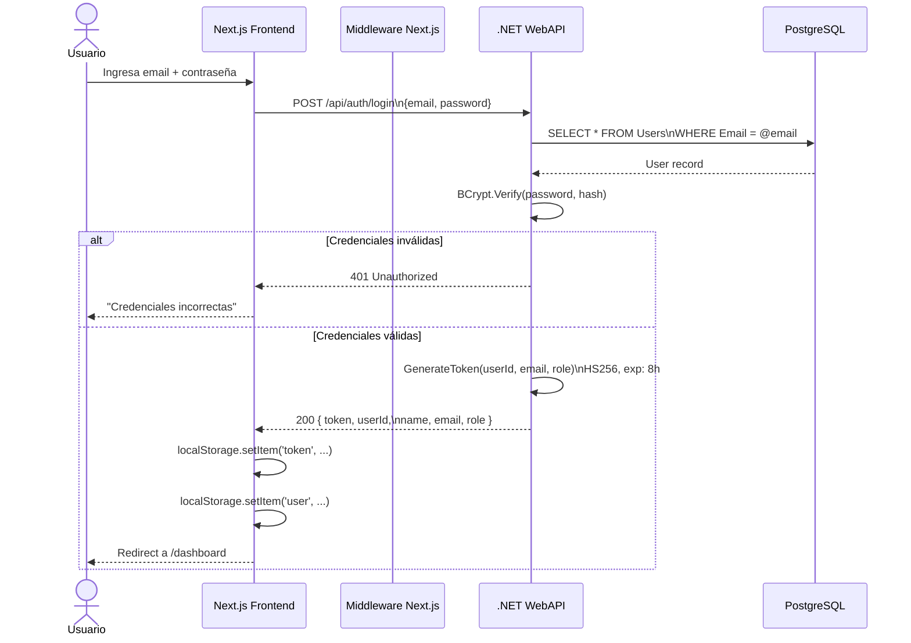
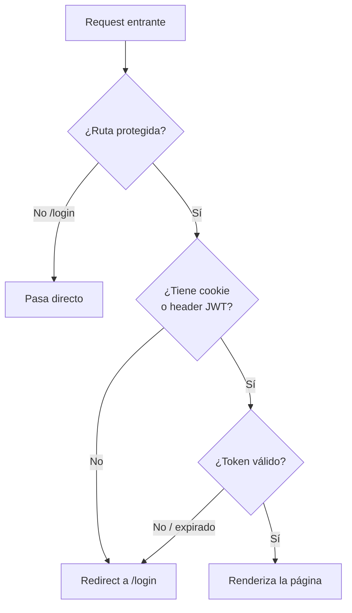
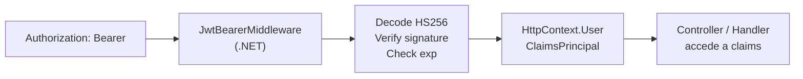
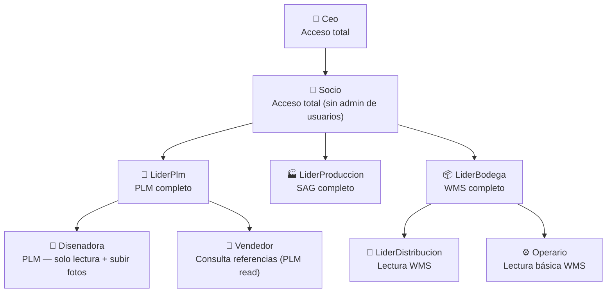

# Flujo de Autenticación

## Visión general

El sistema usa **JWT Bearer (HS256)** sin refresh tokens. El token se almacena en `localStorage` del browser (simplificado para MVP interno).

## Flujo de login

## Middleware de rutas (Next.js)

Las rutas públicas son solo `/login`. Todo lo demás requiere token.

## Validación en el backend

Cada endpoint protegido lleva `[Authorize]`. Los endpoints que requieren rol específico usan `[Authorize(Roles = "Ceo,Socio")]`.

## Roles del sistema

## Claims en el JWT

| Claim | Valor |
|---|---|
| `sub` | GUID del usuario |
| `email` | email del usuario |
| `name` | nombre completo |
| `role` | nombre del enum `UserRole` |
| `iat` | issued at (Unix timestamp) |
| `exp` | expiry — 8 horas desde emisión |
