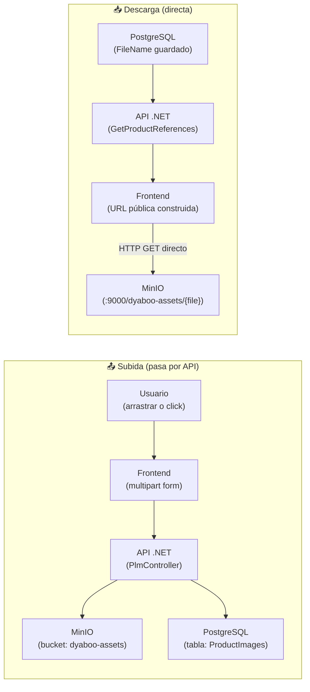
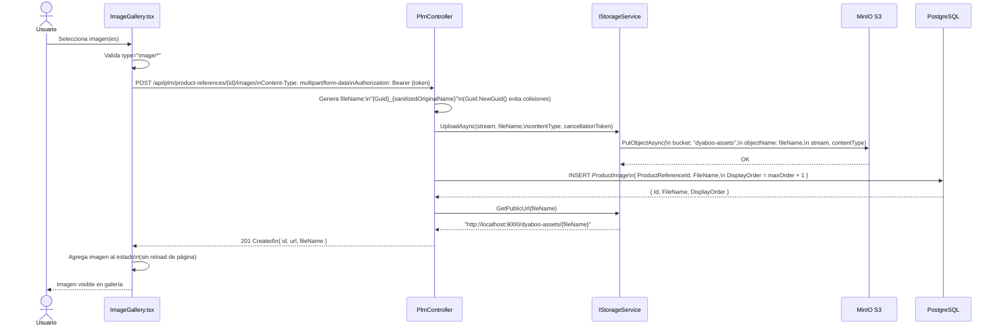
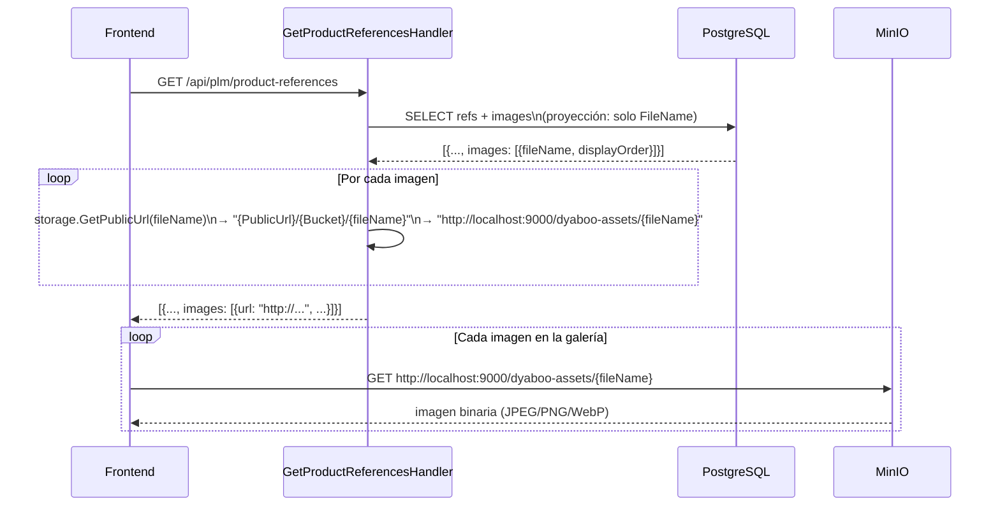
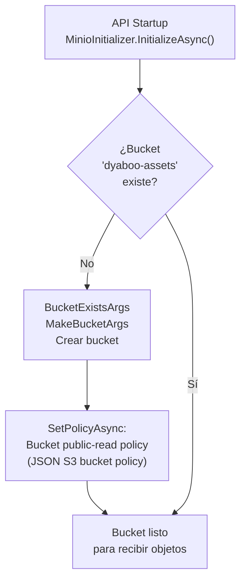

# Pipeline de Imágenes con MinIO

## Arquitectura de almacenamiento

Las imágenes **nunca pasan por la API en descarga** — se sirven directamente desde MinIO al browser. La API solo actúa como proxy de subida y gestiona el registro en BD.



## Flujo detallado de subida



## Flujo de descarga (servicio de URLs)



## Configuración del bucket



La política del bucket permite lectura pública sin autenticación a cualquier objeto en `dyaboo-assets/*`. Esto habilita que los browsers accedan a las imágenes directamente.

## Interfaz `IStorageService`

```csharp
// Definida en Application Layer — sin dependencia de MinIO
public interface IStorageService
{
    Task UploadAsync(Stream stream, string fileName,
                     string contentType, CancellationToken ct);
    Task DeleteAsync(string fileName, CancellationToken ct);
    string GetPublicUrl(string fileName);
}
```

`MinioStorageService` en Infrastructure implementa esta interfaz con el SDK de MinIO. Si en el futuro se cambia a AWS S3 o Azure Blob, solo se reemplaza la implementación — el resto del sistema no cambia.

## Variables de entorno relevantes

| Variable | Propósito |
|---|---|
| `Minio__Endpoint` | Host:puerto MinIO desde la API (`minio:9000` en Docker) |
| `Minio__AccessKey` | Credencial de acceso |
| `Minio__SecretKey` | Credencial secreta |
| `Minio__Bucket` | Nombre del bucket (`dyaboo-assets`) |
| `Minio__PublicUrl` | URL base para URLs públicas (`http://localhost:9000`) |
| `Minio__UseSSL` | `false` en desarrollo, `true` con HTTPS en producción |
| `NEXT_PUBLIC_MINIO_URL` | URL MinIO usada por el browser (igual a `PublicUrl`) |

## Formatos soportados

Cualquier `Content-Type: image/*` es aceptado por el backend (no hay validación de formato específica — se guarda tal cual). El browser puede renderizar JPEG, PNG, WebP, GIF, AVIF.

## Eliminación de imágenes

Al eliminar una imagen, el flujo es siempre:
1. Obtener `FileName` de PostgreSQL
2. Eliminar objeto de MinIO (`RemoveObjectAsync`)
3. Eliminar registro de PostgreSQL

Este orden garantiza que si falla el paso 3, la próxima vez que se intente eliminar se podrá reintentar (el registro aún existe). Si falla el paso 2, el archivo queda huérfano en MinIO (mejora futura: job de limpieza).
