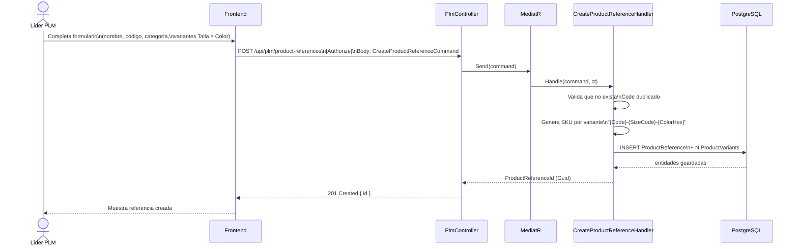
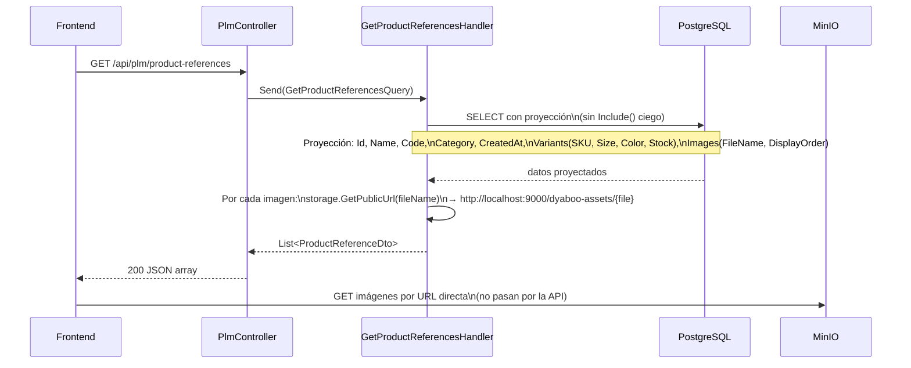
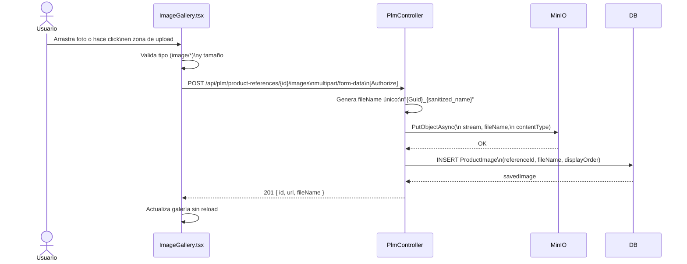
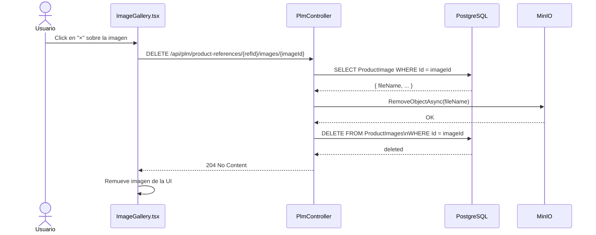
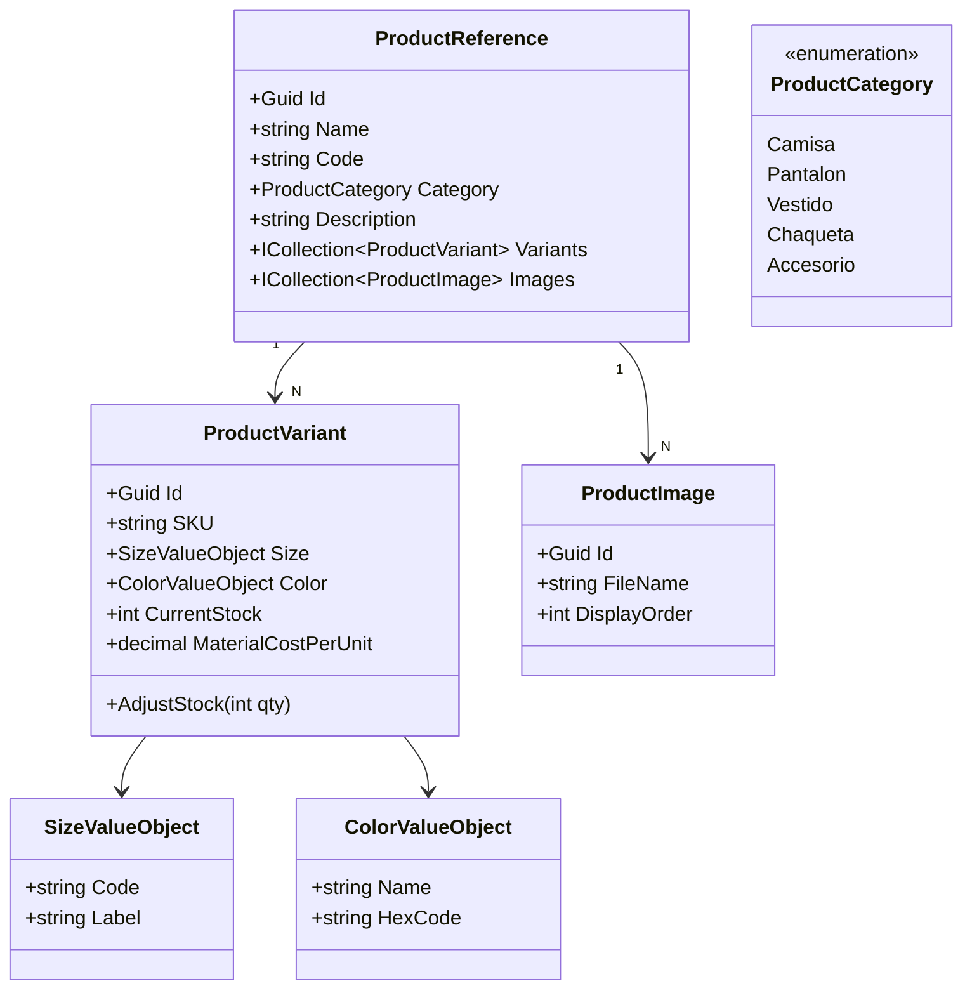

# Módulo PLM — Product Lifecycle Management

## Responsabilidad

Gestiona el ciclo de vida de las **referencias textiles**: creación de productos con todas sus variantes Talla × Color, y su galería de imágenes.

## Flujo: Crear referencia de producto

## Flujo: Listar referencias con imágenes

## Flujo: Subir imagen

## Flujo: Eliminar imagen

## Modelo de dominio

## Endpoints REST

| Método | URL | Descripción |
|---|---|---|
| `GET` | `/api/plm/product-references` | Listar todas las referencias |
| `POST` | `/api/plm/product-references` | Crear referencia con variantes |
| `POST` | `/api/plm/product-references/{id}/images` | Subir imagen (multipart) |
| `DELETE` | `/api/plm/product-references/{id}/images/{imgId}` | Eliminar imagen |
