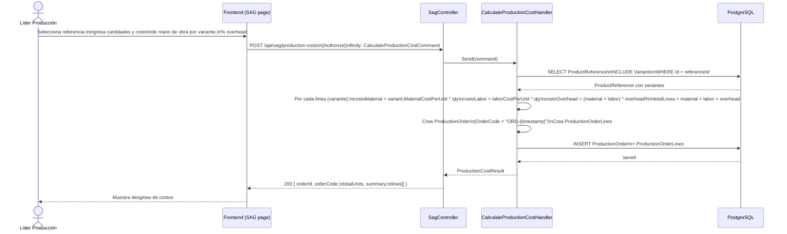
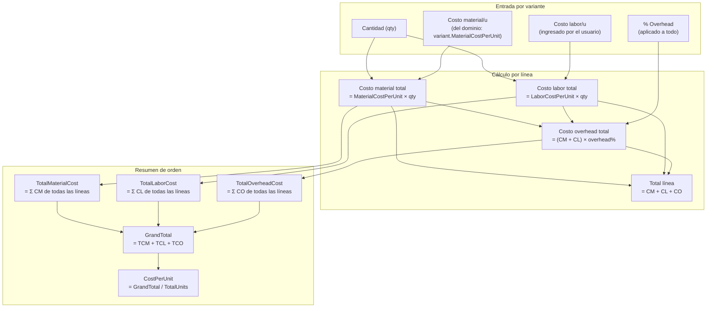
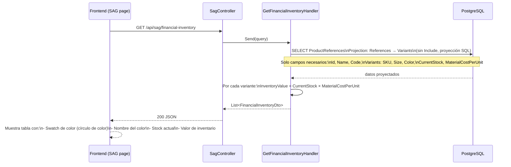
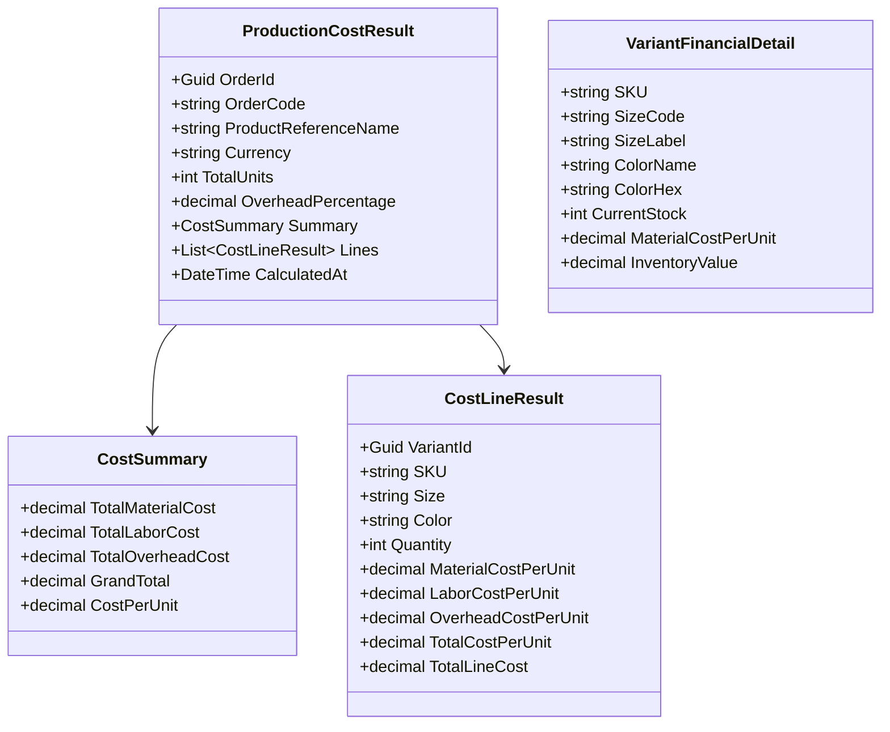

# Módulo SAG — Sistema de Administración y Gestión

## Responsabilidad

Calcula los **costos de producción** por orden y mantiene el **inventario financiero** con el valor de stock actual por variante.

## Flujo: Calcular costo de producción

## Cálculo de costos — detalle

## Flujo: Inventario financiero

## Modelo de datos SAG

## Endpoints REST

| Método | URL | Descripción |
|---|---|---|
| `POST` | `/api/sag/production-costs` | Calcular y registrar orden de producción |
| `GET` | `/api/sag/financial-inventory` | Inventario financiero de todas las referencias |

## Vinculación con otros módulos

- **PLM**: Lee `ProductReference.Variants` para obtener el costo de material por variante (`MaterialCostPerUnit`).
- **WMS**: Al asignar stock (`AssignStock`), el handler llama a `variant.AdjustStock(qty)` que actualiza `CurrentStock` en el dominio — el mismo campo que SAG usa para calcular valor de inventario.
