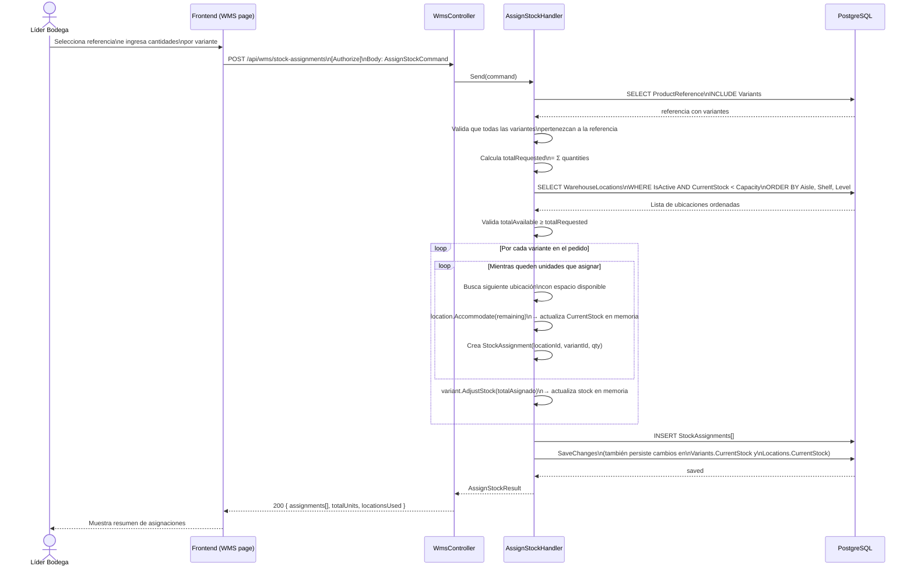
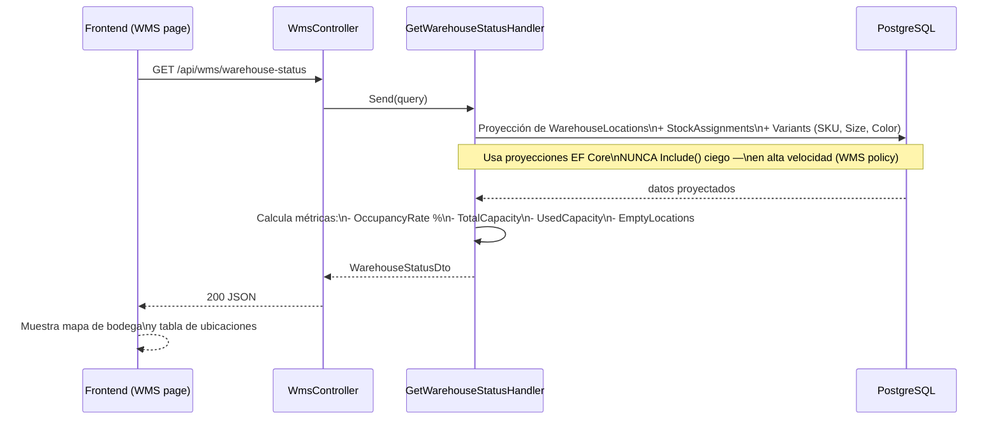
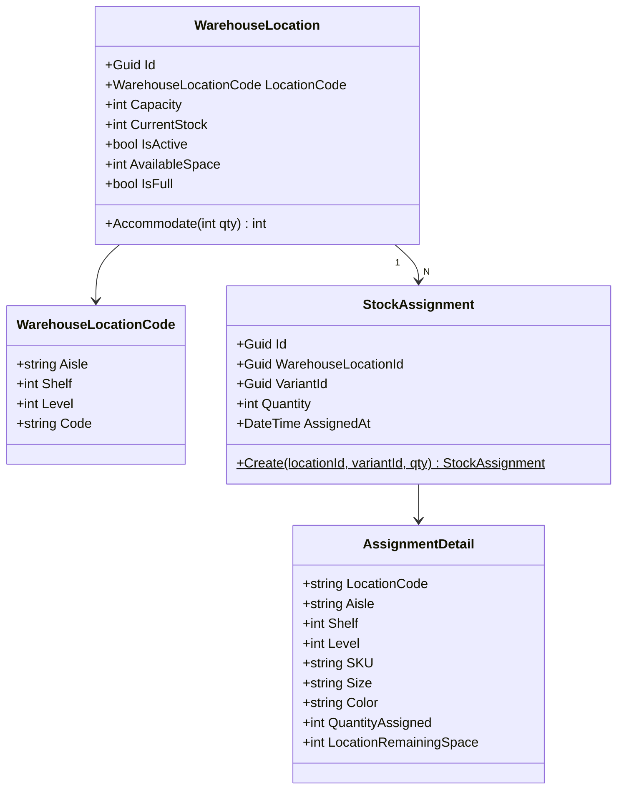

# Módulo WMS — Warehouse Management System

## Responsabilidad

Gestiona la **asignación física de unidades** en la bodega. Distribuye variantes de productos en ubicaciones (Pasillo / Estante / Nivel) con llenado secuencial inteligente.

## Flujo: Asignar stock a ubicaciones



## Algoritmo de llenado secuencial

```mermaid
flowchart TD
    START["Inicio:\nlocationIdx = 0\npor cada variante"]
    SKIP["locationIdx++\n(avanza a siguiente)"]
    CHECK{¿Location[idx]\nestá llena?}
    ACCOM["location.Accommodate(remaining)\n→ assigned = min(remaining, availableSpace)\n→ location.CurrentStock += assigned\n→ remaining -= assigned"]
    CREATE["Crea StockAssignment\n(location, variant, assigned)"]
    MORE{¿remaining > 0?}
    NEXT_VAR["Siguiente variante"]

    START --> CHECK
    CHECK -->|Sí| SKIP --> CHECK
    CHECK -->|No| ACCOM --> CREATE --> MORE
    MORE -->|Sí| CHECK
    MORE -->|No| NEXT_VAR
```

Las ubicaciones se cargan **ordenadas** por `Aisle → Shelf → Level` desde la BD, lo que garantiza llenado en orden físico lógico (A-01-01, A-01-02, ..., A-02-01, ..., B-01-01, etc.).

## Flujo: Estado de bodega



## Modelo de dominio



## Estructura de la bodega (datos seeded)

| Dimensión | Valor |
|---|---|
| Pasillos | A, B, C, D, E, F |
| Estantes por pasillo | 10 (1–10) |
| Niveles por estante | 10 (1–10) |
| **Total ubicaciones** | **600** |
| Capacidad por ubicación | 50 unidades |
| Capacidad total bodega | 30.000 unidades |

Código de ubicación: `{Pasillo}-{Estante:D2}-{Nivel:D2}` → ejemplo: `A-03-07`

## Endpoints REST

| Método | URL | Descripción |
|---|---|---|
| `POST` | `/api/wms/stock-assignments` | Asignar unidades a ubicaciones |
| `GET` | `/api/wms/warehouse-status` | Estado actual de bodega |

## Vinculación con otros módulos

- **PLM**: Lee `ProductReference` y sus `Variants` para saber qué se va a asignar.
- **SAG**: Al asignar, llama `variant.AdjustStock()` que actualiza `CurrentStock` — mismo campo que SAG usa en el inventario financiero.
