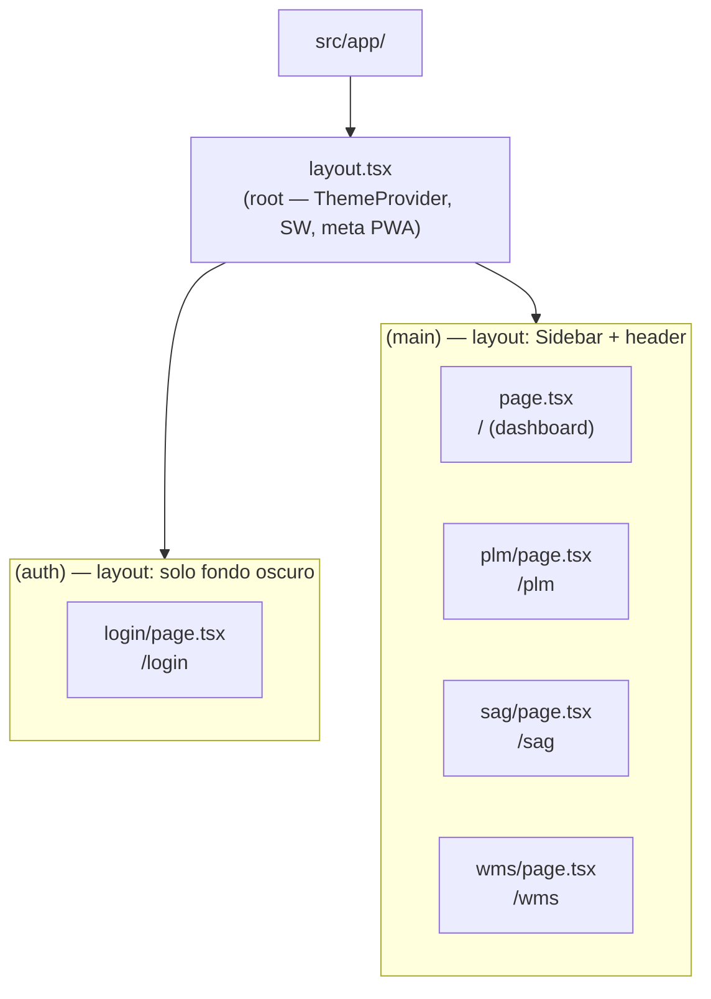
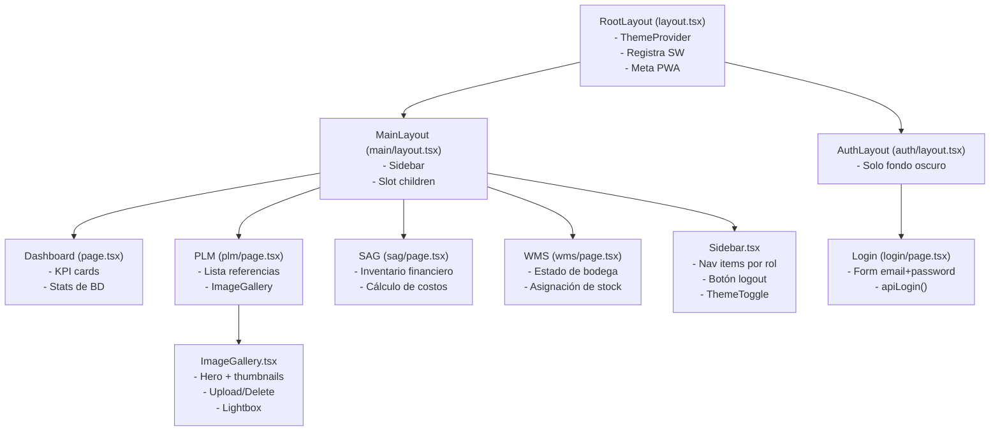
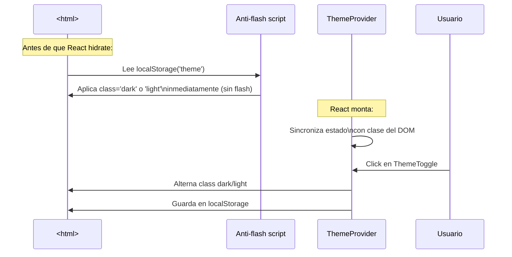
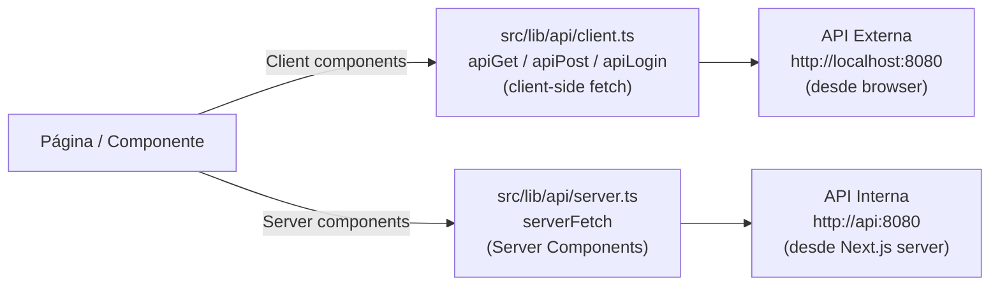

# Arquitectura Frontend (Next.js 15)

## Estructura de rutas — App Router



Los **route groups** `(auth)` y `(main)` comparten el root layout pero tienen layouts propios independientes. Esto evita que el Sidebar y header aparezcan en la pantalla de login.

## Flujo de navegación y protección de rutas

```mermaid
flowchart TD
    REQ["Request del navegador"]
    MW["middleware.ts\n(Next.js Edge)"]
    TOKEN{¿JWT en\nlocalStorage?}
    LOGIN_PAGE["/login"]
    MAIN_APP["App principal\n(layout con Sidebar)"]
    API_CHECK["Client-side:\nchequea token al montar"]

    REQ --> MW
    MW --> TOKEN
    TOKEN -->|No tiene| LOGIN_PAGE
    TOKEN -->|Tiene| MAIN_APP
    MAIN_APP --> API_CHECK
    API_CHECK -->|Token expirado (401)| LOGIN_PAGE
```

> **Nota de seguridad**: El token se almacena en `localStorage`. Para el MVP interno con Electron y red LAN esto es aceptable; en producción web pública migrar a HttpOnly cookies (ver recomendaciones del documento de seguridad).

## Árbol de componentes



## Sistema de temas (dark/light mode)



Tailwind usa `darkMode: 'class'`. Los colores del sistema son CSS custom properties en `globals.css`:

| Variable | Light | Dark |
|---|---|---|
| `--bg` | `#F0EFEB` | `#1A1918` |
| `--surface` | `#FFFFFF` | `#252321` |
| `--accent` | `#108474` | `#108474` |
| `--text` | `#110D0B` | `#F0EFEB` |
| `--muted` | `#7c7975` | `#7c7975` |
| `--border` | `#E5E2DC` | `#302E2C` |
| `--sidebar-bg` | `#473C38` | `#1A1918` |

## Capas de API client



- `NEXT_PUBLIC_API_URL` → usado por el browser (client-side)
- `API_INTERNAL_URL` → usado por Server Components y Route Handlers (server-side)
- Server-side no tiene CORS: va directo de contenedor a contenedor en la red Docker

## Sesión y almacenamiento local

```typescript
// src/lib/auth/session.ts
saveSession({ token, userId, name, email, role })
  → localStorage('dyaboo_token') = token
  → localStorage('dyaboo_user')  = { userId, name, email, role }

getToken()   → string | null
getUser()    → { userId, name, email, role } | null
clearSession() → borra ambas claves → redirect /login
```

## PWA (Progressive Web App)

| Archivo | Propósito |
|---|---|
| `src/app/manifest.ts` | Genera `/manifest.webmanifest` en runtime (Next.js App Router) |
| `public/sw.js` | Service Worker — network-first para navegación; no intercepta API ni MinIO |
| `public/icons/` | icon-192.png, icon-512.png (maskable), apple-touch-icon.png, favicon.ico |
| `src/app/layout.tsx` | Registra el SW + metadata PWA (themeColor, appleWebApp) |

El SW es **network-first**: si hay red → respuesta fresca; si no → caché. Solo intercepta requests de navegación (`document`), no llamadas a la API ni imágenes de MinIO.

## Security headers (next.config.ts)

Todos los headers se aplican a `source: '/(.*)'` (todas las rutas):

| Header | Valor |
|---|---|
| `X-Content-Type-Options` | `nosniff` |
| `X-Frame-Options` | `DENY` |
| `X-XSS-Protection` | `1; mode=block` |
| `Referrer-Policy` | `strict-origin-when-cross-origin` |
| `Permissions-Policy` | `camera=(), microphone=(), geolocation=(), payment=()` |
| `Strict-Transport-Security` | `max-age=63072000; includeSubDomains` |
| `Content-Security-Policy` | `default-src 'self'`; allowlist API + MinIO |

## Convenciones de estilos

- Tailwind utility classes para layout y espaciado
- CSS custom properties (`var(--accent)`) para colores del sistema (permite theme switching)
- `style={{ ... }}` inline para valores dinámicos (colores de variante, etc.)
- Sin CSS Modules ni styled-components
- `globals.css`: define custom properties, componentes base (`.card`, `.table-row`, `.page-header`)
- `font-size: 18px` en `html` — base para toda la tipografía relativa

## Dependencias principales

| Paquete | Uso |
|---|---|
| `next` 15.3 | Framework |
| `react` 19 | UI |
| `tailwindcss` 3 | Utilidades CSS |
| `typescript` 5 | Tipado |
| `openapi-typescript` | Genera tipos desde Swagger |
