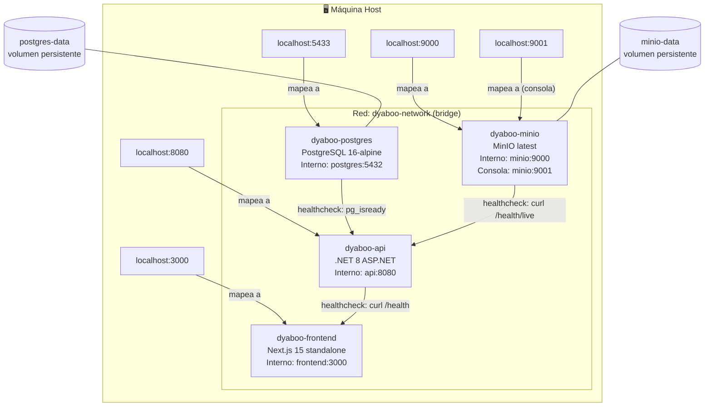
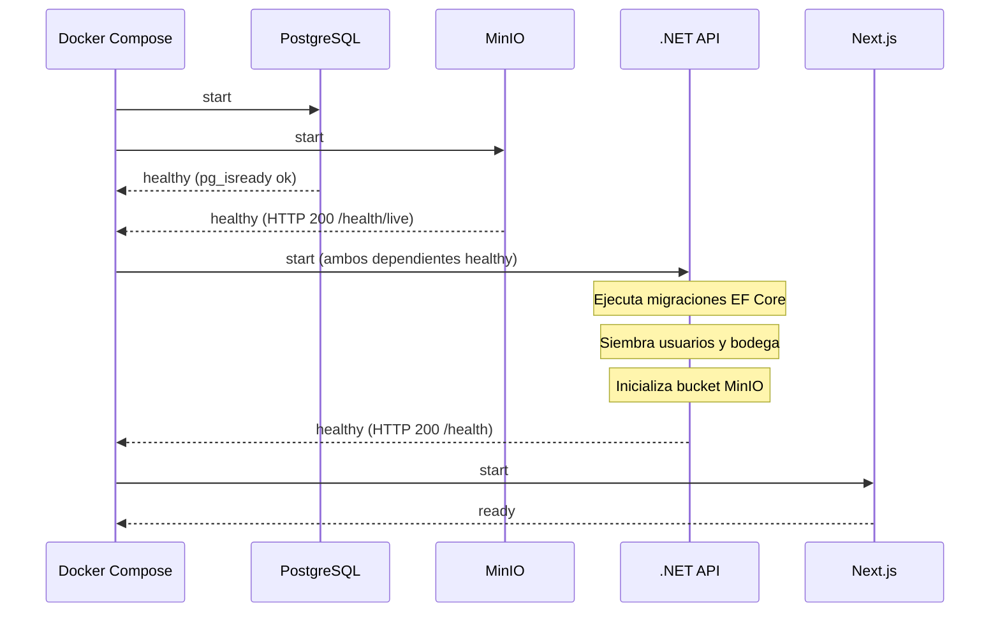
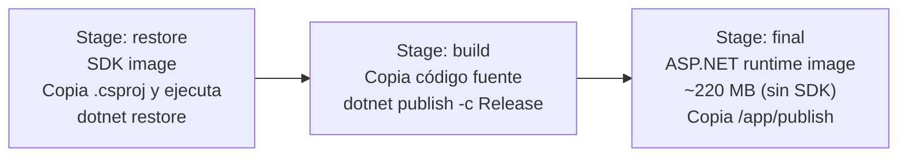

# Infraestructura Docker

## Mapa de servicios y red



## Orden de arranque (depends_on)



## Variables de entorno

### PostgreSQL
| Variable | Valor por defecto |
|---|---|
| `POSTGRES_DB` | `dyaboo_db` |
| `POSTGRES_USER` | `dyaboo_user` |
| `POSTGRES_PASSWORD` | `CAMBIAR_EN_PRODUCCION` |

### MinIO
| Variable | Valor por defecto |
|---|---|
| `MINIO_ROOT_USER` | `dyaboo_minio` |
| `MINIO_ROOT_PASSWORD` | `CAMBIAR_EN_PRODUCCION` |

### API (.NET)
| Variable | Descripción |
|---|---|
| `ConnectionStrings__DefaultConnection` | Cadena de conexión PostgreSQL interna |
| `Minio__Endpoint` | `minio:9000` (nombre de servicio Docker) |
| `Minio__AccessKey` | Usuario MinIO |
| `Minio__SecretKey` | Contraseña MinIO |
| `Minio__Bucket` | `dyaboo-assets` |
| `Minio__PublicUrl` | `http://localhost:9000` (URL pública desde el browser) |
| `Minio__UseSSL` | `false` |

### Frontend (Next.js)
| Variable | Descripción |
|---|---|
| `NEXT_PUBLIC_API_URL` | `http://localhost:8080` — usada por el browser |
| `NEXT_PUBLIC_MINIO_URL` | `http://localhost:9000` — usada por el browser |
| `API_INTERNAL_URL` | `http://api:8080` — usada por Server Components |

## Comandos principales

```bash
# Levantar todo (primera vez o tras cambios de código)
docker compose up --build

# Solo base de datos (para desarrollo local del backend)
docker compose up postgres

# Ver logs en tiempo real de un servicio
docker compose logs -f api
docker compose logs -f frontend

# Detener sin borrar datos
docker compose down

# Detener Y BORRAR todos los volúmenes (reset completo de BD e imágenes)
docker compose down -v

# Reconstruir ignorando caché (cuando hay problemas de capas cacheadas)
docker compose build --no-cache
```

## Build multi-stage del backend



**Optimización de caché:** Los archivos `.csproj` se copian antes que el código fuente. Si solo cambia código (no dependencias NuGet), el `dotnet restore` usa la capa cacheada y el build es ~10s más rápido.
